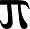

```{r setup, include=FALSE}

knitr::opts_chunk$set(echo = FALSE)
knitr::opts_chunk$set(warning = FALSE)
knitr::opts_chunk$set(message = FALSE)
options(OutDec = ",")
options(DT.options = list(
  language = list(
    paginate = list(previous = 'Vorige', `next` = 'Volgende'),
    search = "Zoeken",
    decimal = ",",
    info = 'Rijen _START_ tot _END_ Totaal: _TOTAL_ rijen',
    lengthMenu = "Toon _MENU_ rijen"
  )))
```

# Titel
*`r format(Sys.time(), "%A %e %B %Y")`* 

```{r Blog_titel, echo = FALSE, fig.align='center', out.width=800}

```

```{r JTIP, echo = FALSE, fig.align='right'}

```